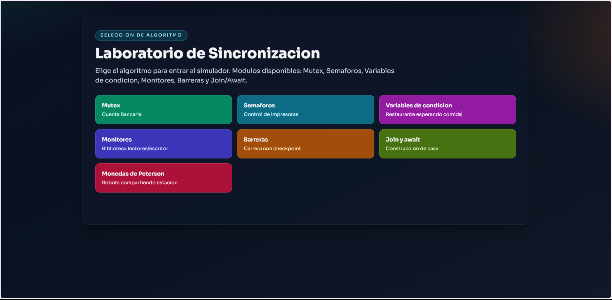

<div align="center">

# 🔐 Simulador de Algoritmos de Sincronización

Simulación interactiva de **algoritmos de sincronización de procesos** para comprender cómo múltiples hilos acceden a recursos compartidos en sistemas concurrentes.

<br>

[](https://github.com/SebastianMoreno0911/AlgoritmoSincronizacion/stargazers)
[](https://github.com/SebastianMoreno0911/AlgoritmoSincronizacion/network)
[](https://github.com/SebastianMoreno0911/AlgoritmoSincronizacion/issues)
[](https://github.com/SebastianMoreno0911/AlgoritmoSincronizacion)

<br>

### 🎮 Simulación visual de concurrencia en sistemas operativos

Comprende **mutex, semáforos y secciones críticas** mediante una interfaz interactiva desarrollada en JavaScript.

🌐 **Demo en vivo**

[https://sebastianmoreno0911.github.io/AlgoritmoSincronizacion](https://sebastianmoreno0911.github.io/AlgoritmoSincronizacion/)

</div>

---

# 🎬 Vista del Simulador

<div align="center">




</div>

Este simulador permite observar cómo múltiples procesos compiten por recursos compartidos y cómo los algoritmos de sincronización controlan el acceso a la **sección crítica**.

---

# 🧠 Algoritmos Implementados

| Algoritmo                 | Descripción                                                                                                                                                                                                                                                                        |
| ------------------------- | ---------------------------------------------------------------------------------------------------------------------------------------------------------------------------------------------------------------------------------------------------------------------------------- |
| 🔒 Mutex                  | Garantiza exclusión mutua en la sección crítica. Se implementa con el **problema de la cuenta bancaria**, donde varios clientes intentan retirar dinero y el mutex evita condiciones de carrera sobre el saldo.                                                                    |
| 🚦 Semáforos              | Controlan el acceso a recursos limitados mediante contadores. Se implementa con el **control de impresoras**, donde varios usuarios envían trabajos y solo un número limitado de impresoras puede procesarlos simultáneamente.                                                     |
| 🍽 Variables de condición | Permiten que los hilos esperen hasta que se cumpla una condición específica usando `wait` y `signal`. Se implementa con el **restaurante esperando comida**, donde los meseros esperan a que el chef prepare un plato antes de servirlo.                                           |
| 📚 Monitores              | Estructura de sincronización de alto nivel que combina exclusión mutua y variables de condición. Se implementa con el **problema de la biblioteca (lectores–escritores)**, donde múltiples lectores pueden acceder simultáneamente pero los escritores requieren acceso exclusivo. |
| 🏁 Barreras               | Sincronizan múltiples hilos para que todos alcancen un punto antes de continuar. Se implementa con una **carrera con checkpoint**, donde los corredores deben llegar al punto de control antes de iniciar la siguiente fase.                                                       |
| 🏗 Join / Await           | Permite que un hilo espere a que otro termine antes de continuar. Se implementa con el **escenario de construcción de una casa**, donde ciertas etapas (como paredes o techo) deben esperar a que se complete la base.                                                             |
| 🤖 Algoritmo de Peterson  | Algoritmo de exclusión mutua para dos procesos sin hardware especial. Se implementa con **dos robots compartiendo una estación de trabajo**, utilizando variables `flag` y `turn` para coordinar el acceso a la sección crítica.                                                   |

---

# 🎯 Objetivo del Proyecto

Este proyecto fue desarrollado para **visualizar y comprender algoritmos de sincronización**, permitiendo observar:

- Condiciones de carrera
- Exclusión mutua
- Acceso a recursos compartidos
- Control de concurrencia

Es especialmente útil para estudiantes que estudian **Sistemas Operativos** o **Programación Concurrente**.

---

# ⚙️ Tecnologías Utilizadas

| Tecnología   | Uso                       |
| ------------ | ------------------------- |
| HTML5        | Estructura de la interfaz |
| CSS3         | Estilos y diseño          |
| JavaScript   | Lógica del simulador      |
| GitHub Pages | Publicación del simulador |

---

```bash
# 📂 Estructura del Proyecto

AlgoritmoSincronizacion/
│
├── index.html
│
├── css/
│   └── styles.css
│
├── js/
│   ├── engine.js
│   ├── mutex.js
│   ├── semaphore.js
│   └── simulation.js
│
├── docs/
│   └── simulator.gif
│
└── README.md
```

# 🚀 Ejecutar el Proyecto

Clonar el repositorio:
git clone https://github.com/SebastianMoreno0911/AlgoritmoSincronizacion.git

Entrar a la carpeta:
cd AlgoritmoSincronizacion

Abrir el simulador:
index.html

---

# 📚 Conceptos Aplicados

Este proyecto implementa conceptos fundamentales de concurrencia:

- Exclusión mutua
- Sección crítica
- Sincronización de procesos
- Condiciones de carrera
- Control de acceso a recursos

Estos conceptos son esenciales en **Sistemas Operativos modernos**.

---

# 👨‍💻 Autor

**Sebastian Moreno**

Estudiante de Ingeniería de Sistemas

Univeridad Santiago de Cali

Intereses:

- Sistemas Operativos
- Programación Concurrente
- Sincronización
- Desarrollo Web
- Simulación de Algoritmos

GitHub:

https://github.com/SebastianMoreno0911

---

<div align="center">

### 💡 "La concurrencia no trata de velocidad, trata de coordinación." 💡

</div>
